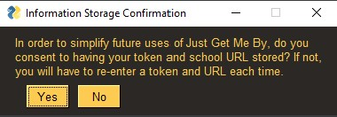

# Just Get Me By
You’re studying hard, absorbing the material, and you are kicking butt on the assignments. However, rumors are flying that the upcoming final is known to ruin grades, and along with your other responsibilities it just may not be feasible to dedicate the effort you usually do give in order to get the grade you want.

This is where Just Get Me By comes in. This is a streamlined desktop app that gathers your coursework, assignments, scores, and grades from your Canvas class(es) and tells you the minimum target scores needed on upcoming assignments in order to get that A.

An entry into BeaverHacks Winter 2021 Hackathon.

## Getting started
1. Download our [latest release for Windows/Linux](https://github.com/rorochaudhary/just-get-me-by/releases/tag/v0.1.0)
2. Double-click on *main.exe*
3. Give us your info!!! (Just kidding, the app doesn't send us any of your info.)
    - Enter your school Canvas url that you regularly log in with (example: canvas.oregonstate.edu) 
    
    - If you already have a generated token, enter it into the appropriate field
    #### How to get a token:
    - Login to your school's Canvas site as you normally do.
    - On the left vertical taskbar, click 'Account'. 
    
    - Click Profile -> Settings. 
    
    - In the Approved Integrations section, click '+New Access Token'. 
    
    - Give a Purpose (ex. Just Get Me By) and click 'Generate Token'. 
    
    - Copy/Paste the Token (including the leading number and ~ sign) into the Your Canvas Token field and click Ok. 
    
    - For easy re-calculation even after closing the app, click Yes on the confirmation page. If you would like to re-enter your information next time, click No. 
    
4. Select your Course from which you need target help. 

5. Your instructor may have more than one grading scale used in your course. Select the one that fits your current course. 

6. Choose your target grade. 

7. Target Scores on your assignments are shown at the bottom. 

